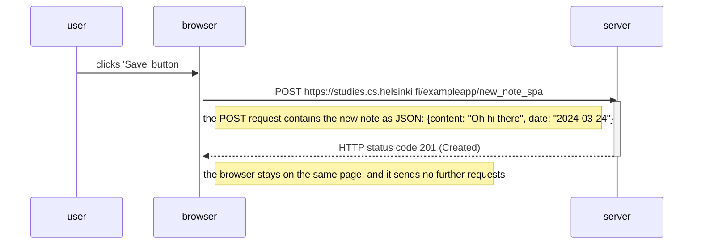

```mermaid
sequenceDiagram
    participant user
    participant browser
    participant server

    user->>browser: clicks 'Save' button
    activate browser
    browser->>server: POST https://studies.cs.helsinki.fi/exampleapp/new_note_spa
    activate server

    Note right of browser: the POST request contains the new note as JSON: {content: "Oh hi there", date: "2024-03-24"}

    server-->>browser: HTTP status code 201 (Created)
    deactivate server

    Note right of browser: the browser stays on the same page, and it sends no further requests
```